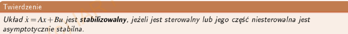
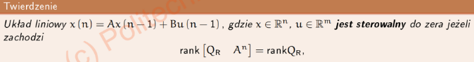

<!-- title: Your Title --> 

## Zadanie 1 {B}
-  a) Orbita jest zawsze, ewolucja nie musi być do tego odwracalna.
-  c) Może być krzywą zamkniętą, ale równie dobrze może się rozbiegać do $\pm inf$.
-  d) Istnieje dla dyskretnych i ciągłych układów.

## Zadanie 2 {A; D}
- b) Dla układu ciągłego powinna być ciągła.
- c) Reguła ewolucji dotyczy całego stanu, nie tylko w otoczeniu równwagi .

## Zadanie 3 {B; C}
- a) Parametr układu nie musi być ściśle powiązany z jego stanem (tak mi się zdaje?).
- d) Może być nieskończenie wymiarowy.

## Zadanie 4 {C}
- a) To robi równanie stanu (Macierze A i B).
- b) To jest akurat transmitancja.
- d) W tym równaniu nie ma żadnych różniczek, bierze się bezpośrenio stany, a nie ich pochodne.

## Zadanie 5 
$$
E\dot{x} = Ax + Bu \\
y = Cx + Du
$$
Gdzie $E \isin R^{n*m}$ jest macierzą osobliwą. To znaczy, że $det(E) = 0$

## Zadanie 6
Automat komórkowy jest dyskretnie dyskretny, więc opisany jest w czasie dyskretnym a jego przestrzeń stanu jest również dyskretna,.

## Zadanie 7 {A}
- b) Nie, ponieważ ma dodatkowe wejście w trzecim wierszu. W układzie wejście działa na tylko jedną zmienną stanu bezpośrednio
- c) Nie, ponieważ macierz jest stanowczo za duża, ponad wymiarowa wręcz. W tym układzie należy wziąć albo $\xi_2$ albo $\phi$. Nie oba.
- d) Nie, ponieważ zmienne stanu na siebie nie oddziałują nawzajem. $\xi_1, \dot{\xi_1}$ nie zawierają w sobie $\xi_2, \dot{\xi_2}$, a $\xi_2, \dot{\xi_2}$ nie zawierają $\xi_1, \dot{\xi_1}$. Na rysunku widać z koleii, że zmienne będą od siebie zależeć, ponieważ masy są ze sobą połączone.

## Zadanie 8 
$$
\frac{s^3 + 1}{2s^3 + s^2} = \frac{1}{2}\cdot\frac{s^3 + 1}{s^3 + \frac{1}{2}s^2} = \frac{1}{2} \cdot \frac{(s^3 + \frac{1}{2}s^2) - \frac{1}{2}s^2 + 1}{s^3 + \frac{1}{2}s^2} = \frac{1}{2} + \frac{1}{2} \cdot \frac{- \frac{1}{2}s^2 + 1}{s^3 + \frac{1}{2}s^2} = \frac{1}{2} + \frac{- \frac{1}{4}s^2 + \frac{1}{2}}{s^3 + \frac{1}{2}s^2} \\
A = \begin{bmatrix}
 0 & 1 & 0\\
 0 & 0 & 1\\
 0& 0& -\frac{1}{2}   
\end{bmatrix}\space
B = \begin{bmatrix}
    0\\0\\1
\end{bmatrix}\space
C = \begin{bmatrix}
    \frac{1}{2} & 0 & -\frac{1}{4}
\end{bmatrix}\space
D = \begin{bmatrix}
    \frac{1}{2}
\end{bmatrix}
$$

## Zadanie 9 {A}
Należy obliczyć wielomian charakterystyczny układu $\Sigma_1$ ze wzoru $det(I\lambda - A)$. Z tego wychodzi $\lambda^2 -4 \lambda + 1$ 

Potem wystarczy obliczyć wielomian charakterystyczny dla $\Sigma_2$ dla podstawianych wartości (lub liczyć na symbolach i podstawić na koniec) i porównać wielomiany. 

## Zadanie 10 {B}
$$
G(s) = C(sI - A)^{-1}B + D \\
sI - A = \begin{bmatrix}
    s + 3 & -1 \\
    0 & s +3
\end{bmatrix} \\
(sI - A)^{-1} = \frac{1}{(s + 3)^2}\begin{bmatrix}
    s + 3 & 1 \\
    0 & s +3
\end{bmatrix}\\
C(sI - A)^{-1}B + D = \frac{1}{(s + 3)^2} \begin{bmatrix}
    1 & 0
\end{bmatrix}\begin{bmatrix}
    s + 3 & 1 \\
    0 & s +3
\end{bmatrix}\begin{bmatrix}
    1\\0
\end{bmatrix} = \frac{s+3}{(s+3)^2} = \frac{1}{s+3}
$$

## Zadanie 11
Wyzliczyć równanie charakterystyczene z $I\lambda - A$, to wyjdzie $\lambda^2 + 2\lambda + 2$, i z niego spisać do postaci sterowalnej $A = \begin{bmatrix}
    0&1\\
    -2&-2
\end{bmatrix}$, a $B = \begin{bmatrix}
    0\\1
\end{bmatrix}$.

## Zadanie 12 {D}
$$
V = x_1^2 + x_2^2 \\ \dot{V} = 2x_1\dot{x_1} + 2x_2\dot{x_2}\\ \dot{V} = 2x_1(x_1^2 + x_2 - x_1^2 - 8x_1 -2x_2) + 2x_2(-3x_2^3) \\ \dot{V} = -16x_1^2-2x_1x_2 + -6x_2^4
$$ 

Nie spełnia warunków lapunowa $\dot{V}$ nie jest zawsze $< 0$ przez człown $-2x_1x_2$ $\\$ Jak dla mnie to odp D

## Zadanie 13 {A; D}
$\dot{V} = -2x_2^2$ nie jest zawsze $<0$, a raczej $\leq 0$, gdzyż przy $x_2 = 0 \rightarrow \dot{V} = 0$ 
    
Stąd jest to pochodna półujemnie okreźlona zamiast ujemnie określonej, dlatego raczej odp. A i D

## Zadanie 14
Warunek który spełnia: dla tego punktu ewolucja układu ustaje $\rightarrow$ A co z układami niestabilnymi, czy one mają punkt równowagi, dla którego ewolucja ustaje??

## Zadanie 15

A więc układ jest stabilizowany, gdy część niesterowalna jest asymptotycznie stabilna.

## Zadanie 16
Stan jest osiągalny, jeżeli istnieje funkcja sterowania u(t) taka, że przeprowadzia tranzycję z dowolnego punktu początkowego do zadanego stanu w skończonym czasie.

## Zadanie 17 {B; D}
Sterowalność\osiągalność można liczyć z kalmana lub matlab ctrb $\rightarrow rank(ctrb) = 1$

Gdzie $Q_r$ to macierz kalmana(ctrb)

Tutaj wg. **MATLABA** $rank(\begin{bmatrix}
    Q_R& A^2
\end{bmatrix}) = 1$, więc układ jest sterowalny do zera.

## Zadanie 18
Trzeba policzyć gradient i podstawić $x_0$ i $u_0$. Z tego wychodzi macierz $A = \begin{bmatrix}
    0&1\\
    1&0
\end{bmatrix}, B = \begin{bmatrix}
0\\1
\end{bmatrix}$. Następnie liczymy macierz $ctrb = \begin{bmatrix}
    0&1\\1&0
\end{bmatrix}$.
Sprawdzamy stopień i otrzymujemy $rank(ctrb) = 2$, więc sterowlny.

## Zadanie 19
W postaci normalnej sterowalnej wszystkie zmienne stanu zależą bezpośrednio lub pośrednio (przez poprzednie zmienne) od wejścia u, dzięki temu, jesteśmy wstanie ustalić dowolną wartość należącą przestrzeni stanu danej zmiennej wykorzystując zmieniające się sterowanie.

## Zadanie 20
Nie mam pojęcia o co cman w tym zadaniu.

## Zadanie 21
Nie mam pojęcia do końca o co cman, ale stawiałbym na to, że tam $x \rightarrow z$ jest też $A \rightarrow \bar{A}$ etc, więc może chodzi o to, że to po prostu liniowe przekształcenie takie jak do formy sterowalnej/obserwowalnej/modalnej? 

## Zadanie 22 {B}
Wyznaczyć wartości własne $\lambda z macierzy A$ $\lambda_1 = 7, \lambda_2 = -2$, więc układ jest niestabilny - odpowiedzu C i D odpadają. Następnie wyznaczam wektory własne $V_1 = \begin{bmatrix}
    1\\1
\end{bmatrix}$ i $V_2 = \begin{bmatrix}
    -\frac{4}{5}\\1
\end{bmatrix}$, więc A ma zupełnie inne wektory narysowane, to bym odrzucił

## Zadanie 23
Chyba strzelałbym w postać normalną Jordana rzeczywistą, gdzie rozkładamy dodatkowo bieguny zespolone poza główną przekątną... ale to nadal gówno a nie odp. Chyba że to po prostu jakaś forma normalna sterowalna\modalna\obserwowalna ale MIMO, czyli coś czego nie robiliśmy i nei robimy w sumie wcale...

## Zadanie 24 {D}
Macierz rozwiązania jest macierzą fundametnalną (tranzycji). Oznacza to, iż została wyliczona jako $\Phi = \mathcal{L} ^{-1} \{(Is - A)^{-1}\}$. Dzięki temu, znając macierz tranzycji możemy znaleźć wartości własne macierzy A. W macierzy tranzycji mamy $e^{-3t}$ i $e^{-2t}$, oznacza to, że wartości własne to $s_1 = -3$ i $s_2 = -2$, ze wzoru $\mathcal{L} ^{-1}(G(s)) = \displaystyle{\lim_{s \to s_n}}(s-s_n)G(s)e^{s_nt}$ Teraz wystarczy podstawiać odpowiedzi tak, aby uzyskać wybrane wartości własne. 

## Zadanie 25
Że co? (ZNOWU?!)

## Zadanie 26 {A}
Policzone $det(\lambda I - (A-LC))$ i wychodzi $\lambda_1 = -10.2$ i $\lambda_2 = 0.2$ no to jeden jest prawa półpłaszczyzna zespolona to niestabilny.

## Zadanie 27 {B}
$K = P*C^T(CPC^T+R)^{-1}$ więc jak R rośnie, to K maleje.

## Zadanie 28
Zasada separacji mówi, że można projektować obserwator i regulator dla układu niezależnie. Można zatem dobrać wzmocnienia, a co za tym idzie bieguny układu dla obserwatora i regulatora niezależnie od siebie, gdyż nie mają na siebie wpływu.

## Zadanie 29 {B}
Policzyć ładnie $det(\lambda I - (A-LB))$, i wychodzą równania na $\lambda$ zawierające w sobie k, dzięki temu wiedząc, że $\lambda < 0$ możemy wyznaczyć k z nierówności i daje to $k \isin (3; \frac{21}{4})$

## Zadanie 30
Że co? (ZNÓW ZNOWU?!)

## Zadanie 31 {C}
r $\rightarrow$ y referencyjne

$$
\dot{x_1} = 2x_2 \\ 
\dot{x_2} = -2x_1 -4x_2 + u \\
r = x_1 \\ x_2 = \frac{1}{2}\dot{r} \\ 
\dot{x_2} = \frac{1}{2}\ddot{r} \\ 
u = \frac{1}{2}\ddot{r} + 2\dot{r} + 2r \\ 
\begin{bmatrix} x_1 &x_2  \end{bmatrix} = \begin{bmatrix} r & \frac{1}{2}\dot{r}  \end{bmatrix}
$$

## Zadanie 32 
Nie wiem

## Zadanie 33 {C; D}

- a) ponieważ warunki sterowalności i osiągalności są takie same (macierz ctrb etc) to odpada
- b) bullshiet totalny
- d) nie mam pojęcia jakie musi być Q, ale chyba też poprawna

Na pewno C jest prawidłowa tbh

## Zadanie 34
Droga $A \rightarrow B \rightarrow F \rightarrow H \rightarrow K$

Nie mam pojęcia co oznacza to coś pod spodem, ale jakbym miał zgadywać to byłby to najniższy koszt przejścia $V_N \rightarrow V_K$, więc

|           |           |           |
| --------- | --------- | --------- |
| $V_A = 5$ |           |           |
| $V_B = 4$ | $V_C = 4$ | $V_D = 6$ |
| $V_E = 3$ | $V_F = 2$ | $V_G = 3$ |
| $V_H = 1$ | $V_I = 1$ | $V_J = 3$ |
| $V_K = 0$ |           |           |

Ale to jest takie zgadywanie...

